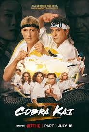
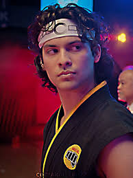

<html lang="sv">
<head>
    <meta charset="UTF-8">
    <meta name="viewport" content="width=device-width, initial-scale=1.0">
    <title>Miguel Kai</title>
    
</head>
<body>

    

        <h1>Cobra Kai</h1>

        

        
Jag har alltid tyckt att den spännande rivaliteten mellan Johnny Lawrence och Daniel LaRusso är seriens hjärta. Att se hur de två gamla fienderna tvingas konfrontera sitt förflutna samtidigt som de navigerar i en ny era av karatekrig är otroligt fängslande. Det är mer än bara slagsmål; det är en berättelse om försoning, mentorskap och att hitta sin plats i världen.

        
Min absoluta favoritkaraktär i serien är Miguel Diaz. Hans resa från en osäker kille som blir mobbad till att bli en självsäker karateka är en av de mest inspirerande delarna av serien. Han är en genuin karaktär som man verkligen hejar på.

        <h2>Analys av Miguels strider</h2> 
        
Miguels strider är alltid fulla av dramatik. Han har vunnit många viktiga matcher, som när han besegrade Robby Keene i All Valley-turneringen. Den segern visade hur mycket han hade vuxit både fysiskt och mentalt under Johnnys ledning. Å andra sidan har han också förlorat strider, som i slutet av säsong 2 när han råkade illa ut efter en våldsam konfrontation med Robby. Dessa förluster är lika viktiga för hans karaktärsutveckling, eftersom de tvingar honom att möta sina begränsningar och växa som person.

        
    

</body>
</html>
